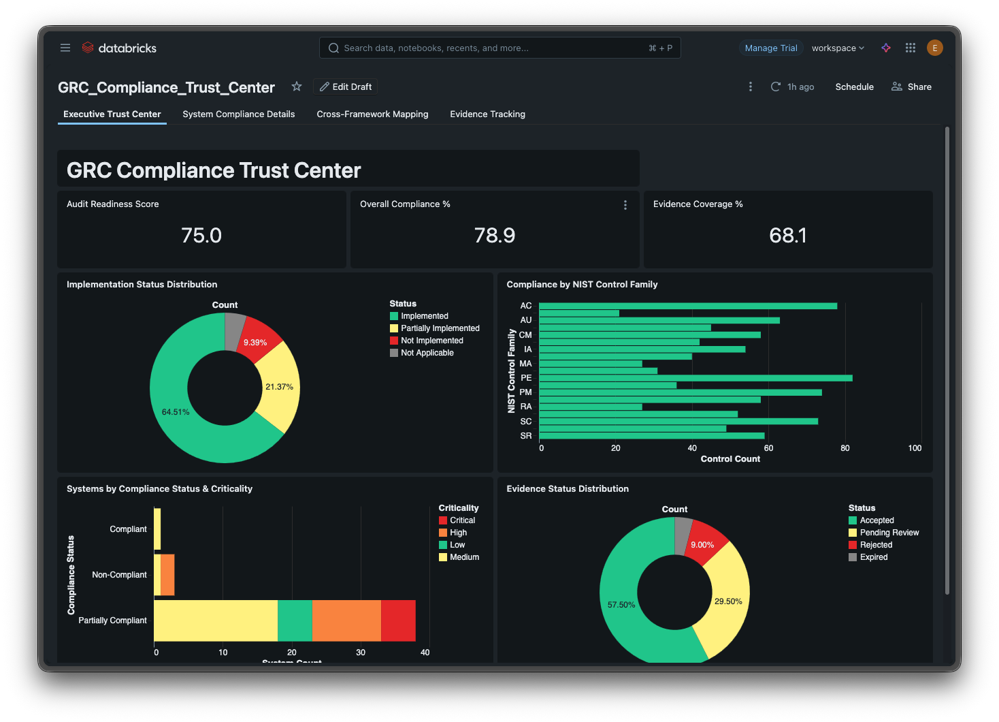
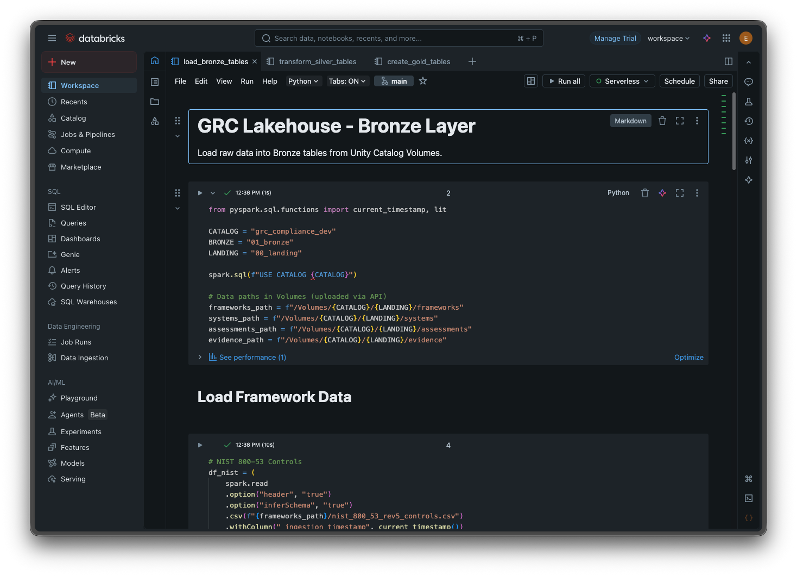
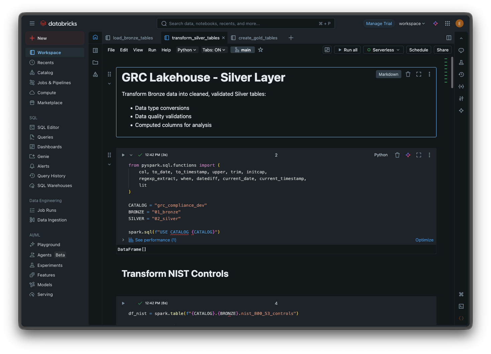
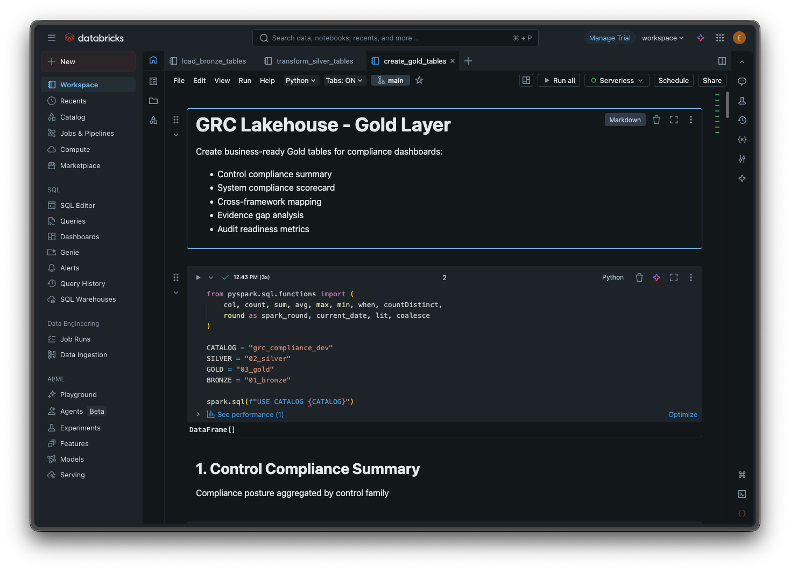

# GRC Compliance Lakehouse

Databricks-based compliance management system. Tracks NIST 800-53 and SOC2 controls, evidence collection, and audit readiness across enterprise systems.



## What This Does

- Ingests NIST 800-53 Rev 5 controls (188 controls) and SOC2 Trust Service Criteria
- Maps controls across frameworks (100 NIST-to-SOC2 mappings)
- Tracks control assessments and evidence per system
- Runs compliance rules to auto-flag issues
- ML model predicts which controls are likely to fail
- Dashboard shows compliance posture, gaps, and risk

## Architecture

```
grc_compliance_dev (Unity Catalog)
|-- 00_landing   # Raw files in Volumes
|-- 01_bronze    # Raw tables (controls, systems, assessments, evidence)
|-- 02_silver    # Cleaned + validated (compliance scores, overdue flags)
|-- 03_gold      # Aggregations + ML outputs (scorecards, alerts, predictions)
```

### Bronze Layer


### Silver Layer


### Gold Layer


## Quick Start

### Prerequisites
- Databricks workspace with Unity Catalog
- Compute cluster or SQL Warehouse

### Deploy

1. Clone repo to Databricks Workspace (Repos > Add Repo)

2. Run setup notebook:
   ```
   code/00_Setup/setup_grc_lakehouse.py
   ```

3. Upload data files to Volumes (REST API or CLI):
   ```bash
   # Framework data
   curl -X PUT "https://<workspace>/api/2.0/fs/files/Volumes/grc_compliance_dev/00_landing/frameworks/nist_800_53_rev5_controls.csv" \
     -H "Authorization: Bearer <token>" \
     --data-binary @data/frameworks/nist_800_53_rev5_controls.csv
   ```

4. Run notebooks in order:
   ```
   code/01_Bronze_Layer/load_bronze_tables.py
   code/02_Silver_Layer/transform_silver_tables.py
   code/03_Gold_Layer/create_gold_tables.py
   code/05_Machine_Learning/compliance_rules.py
   code/05_Machine_Learning/risk_prediction.py
   ```

5. Import dashboard:
   - SQL > Dashboards > Import
   - Upload `code/04_Consumption/Dashboard/GRC_Compliance_Trust_Center.lvdash.json`

## Data Model

### Bronze Tables
| Table | Records | Description |
|-------|---------|-------------|
| nist_800_53_controls | 188 | NIST control catalog |
| soc2_trust_criteria | 64 | SOC2 TSC definitions |
| control_mapping | 100 | NIST-to-SOC2 crosswalk |
| systems_inventory | 50 | Systems under assessment |
| control_assessments | ~1500 | Assessment records |
| evidence_records | 200 | Evidence uploads |

### Gold Tables
| Table | Purpose |
|-------|---------|
| control_compliance_summary | Compliance % by control family |
| system_compliance_scorecard | Per-system posture |
| cross_framework_mapping | NIST-SOC2 with compliance status |
| evidence_gap_analysis | Missing/expiring evidence |
| audit_readiness_metrics | Executive readiness score |
| compliance_alerts | Rule engine output |
| control_risk_predictions | ML risk scores |

## Rule Engine

Auto-flags compliance issues:
- Expired evidence
- Overdue remediations
- Stale assessments (>9 months)
- Critical system coverage gaps
- Evidence gaps

Output: `03_gold.compliance_alerts`

## ML Model

Random Forest classifier predicts control failure risk.

Features:
- Historical compliance score
- Days to remediation
- Evidence count
- Gap severity
- System criticality
- Control family

Output: `03_gold.control_risk_predictions` with risk_score (0-1) and risk_level (High/Medium/Low)

## Dashboard

4 pages:
1. Executive Trust Center - Overall compliance posture
2. System Compliance Details - Per-system scorecard
3. Cross-Framework Mapping - NIST to SOC2 coverage
4. Evidence Tracking - Gaps and collection status

## Project Structure

```
databricks-GRC-demo/
|-- code/
|   |-- 00_Setup/
|   |-- 01_Bronze_Layer/
|   |-- 02_Silver_Layer/
|   |-- 03_Gold_Layer/
|   |-- 04_Consumption/Dashboard/
|   |-- 05_Machine_Learning/
|-- data/
|   |-- frameworks/    # NIST, SOC2, mapping CSVs
|   |-- generators/    # Mock data scripts
|   |-- mock/          # Generated test data
|-- README.md
```

## Tech Stack

- Databricks Unity Catalog
- Delta Lake
- PySpark
- MLflow
- Databricks SQL Dashboards

## License

MIT
