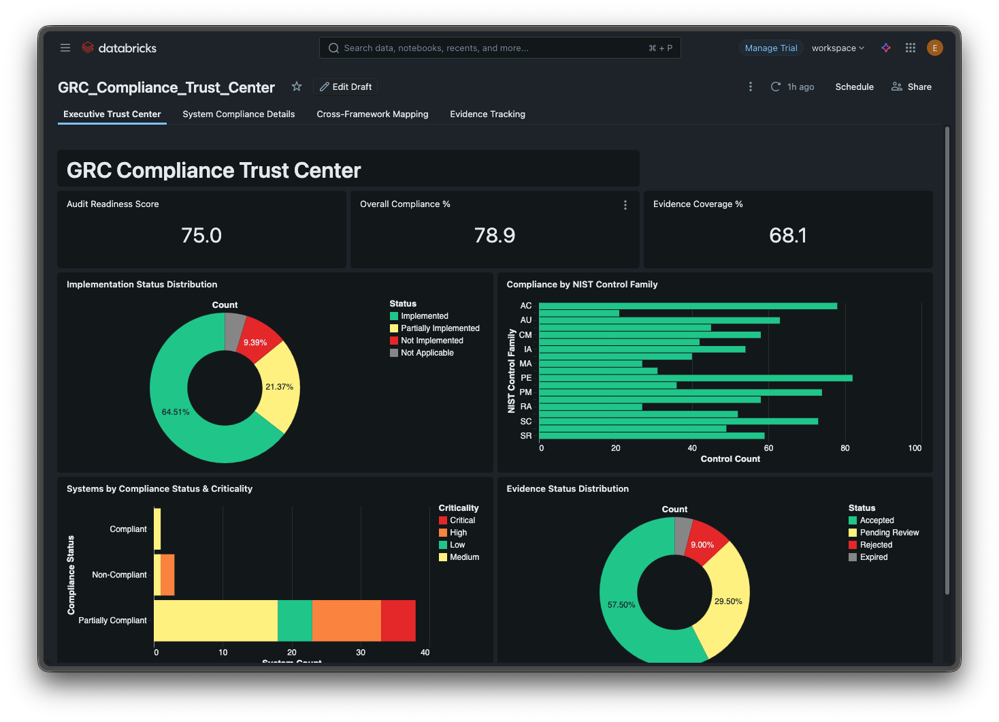
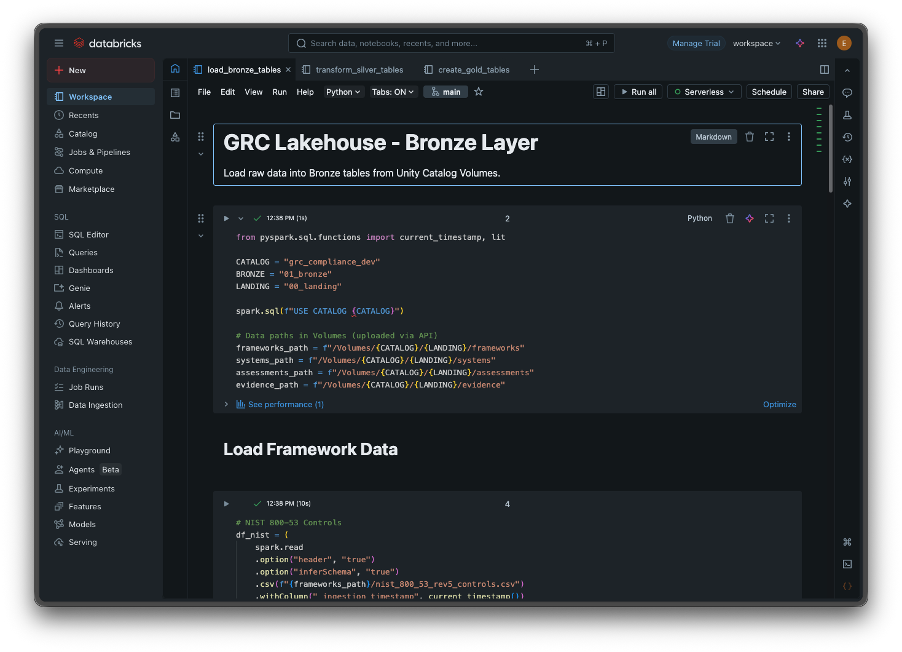
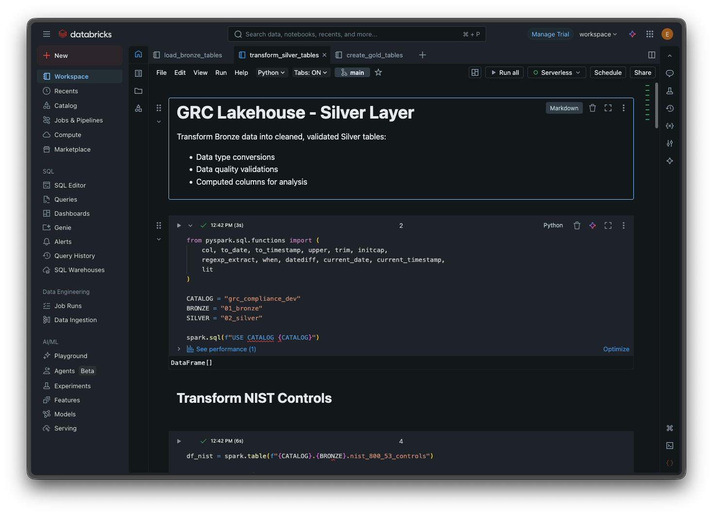
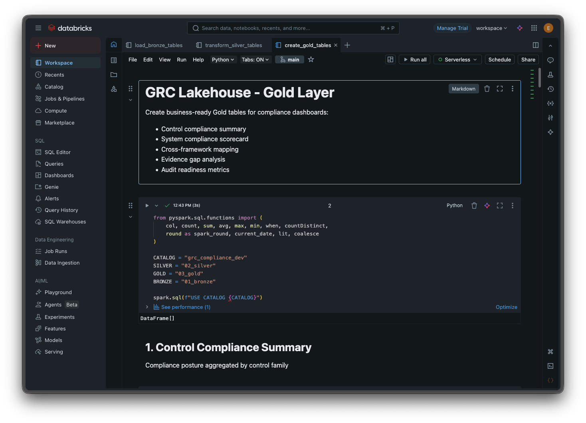

# GRC Compliance Lakehouse on Databricks

GRC evidence lives in ticketing, SIEMs, IAM, cloud configs, and whatever policy docs the team last updated. Pulling it together for an audit is mostly hand work. This repo is a reference lakehouse that treats controls, assessments, and evidence as first-class data: a Databricks medallion pipeline that normalizes a control catalog, runs a rule engine over the evidence layer, and scores future control failure risk with a trained model.

The demo ships NIST 800-53 Rev 5 as the authoritative control catalog, plus synthetic assessment and evidence data for a fictional 50-system environment. If you want to run it against real SOC 2, ISO 27001, or PCI DSS content, bring your own licensed extracts. I stripped those out of the repo for licensing reasons.



## What's here

- **Medallion pipeline on Unity Catalog.** Bronze, Silver, and Gold schemas in `grc_compliance_dev`. Raw controls and operational data land in Bronze, cleaned and validated tables in Silver, scorecards and ML output in Gold.
- **188 NIST 800-53 Rev 5 controls** loaded from the public CSRC catalog into `01_bronze.nist_800_53_controls`.
- **Synthetic operational data.** 50 systems, ~1500 control assessments, 200 evidence records. Enough to exercise every downstream query without touching real audit data.
- **Rule engine** at `code/05_Machine_Learning/compliance_rules.py`. Flags expired evidence, overdue remediations, stale assessments older than nine months, evidence gaps, and critical-system coverage holes. Output lands in `03_gold.compliance_alerts`.
- **Risk prediction model.** Random Forest trained on historical compliance score, days to remediation, evidence count, gap severity, system criticality, and control family. Writes `risk_score` (0 to 1) and `risk_level` (High/Medium/Low) to `03_gold.control_risk_predictions`. MLflow-tracked.
- **Databricks SQL dashboard** at `code/04_Consumption/Dashboard/GRC_Compliance_Trust_Center.lvdash.json`. Executive Trust Center, per-system scorecard, cross-framework mapping, and evidence tracking.

## Architecture

```
grc_compliance_dev (Unity Catalog)
|-- 00_landing   # Raw files in Volumes
|-- 01_bronze    # Raw tables (controls, systems, assessments, evidence)
|-- 02_silver    # Cleaned + validated (compliance scores, overdue flags)
|-- 03_gold      # Aggregations + ML output
```

### Bronze Layer


### Silver Layer


### Gold Layer


## Run it

### Prerequisites
- Databricks workspace with Unity Catalog
- Compute cluster or SQL Warehouse
- For `risk_prediction.py`: Databricks ML runtime, or pre-install `mlflow`, `scikit-learn`, `shap`

### Steps

1. Clone this repo into your Databricks Workspace (Repos > Add Repo).

2. Run the setup notebook to create the catalog and Volumes:
   ```
   code/00_Setup/setup_grc_lakehouse.py
   ```

3. Upload the NIST controls file to the landing volume:
   ```bash
   curl -X PUT "https://<workspace>/api/2.0/fs/files/Volumes/grc_compliance_dev/00_landing/frameworks/nist_800_53_rev5_controls.csv" \
     -H "Authorization: Bearer <token>" \
     --data-binary @data/frameworks/nist_800_53_rev5_controls.csv
   ```

4. Run the pipeline in order:
   ```
   code/01_Bronze_Layer/load_bronze_tables.py
   code/02_Silver_Layer/transform_silver_tables.py
   code/03_Gold_Layer/create_gold_tables.py
   code/05_Machine_Learning/compliance_rules.py
   code/05_Machine_Learning/risk_prediction.py
   ```

5. Import the dashboard: SQL > Dashboards > Import, then upload `code/04_Consumption/Dashboard/GRC_Compliance_Trust_Center.lvdash.json`.

> **Heads up:** the bronze, silver, and gold notebooks still reference `soc2_tsc_2017.csv` and `nist_to_soc2_mapping.csv` in a few places. Those files were removed from this repo (see [Multi-framework support](#multi-framework-support)). Either drop your own licensed SOC 2 extract in with those filenames before step 4, or comment out the SOC 2 blocks in the notebooks.

## Data model

### Bronze tables
| Table | Records | Description |
|-------|---------|-------------|
| nist_800_53_controls | 188 | NIST control catalog |
| systems_inventory | 50 | Systems under assessment |
| control_assessments | ~1500 | Assessment records |
| evidence_records | 200 | Evidence uploads |

### Gold tables
| Table | Purpose |
|-------|---------|
| control_compliance_summary | Compliance % by control family |
| system_compliance_scorecard | Per-system posture |
| evidence_gap_analysis | Missing or expiring evidence |
| audit_readiness_metrics | Executive readiness score |
| compliance_alerts | Rule engine output |
| control_risk_predictions | ML risk scores |

## Rule engine

The rules module emits structured alerts into `03_gold.compliance_alerts`. Current rules:

- Expired evidence (evidence past its stated valid_until date)
- Overdue remediations (assessments with remediation deadlines in the past and status not Implemented)
- Stale assessments (last assessed more than nine months ago)
- Critical-system coverage gaps (high-criticality systems missing assessments on baseline controls)
- Evidence gaps (controls with no evidence records linked)

Each rule contributes a row per violation with a severity, a system reference, and a short description. Adding a new rule is a single function in `compliance_rules.py`.

## ML model

Random Forest classifier. Features: historical compliance score, days to remediation, evidence count, gap severity, system criticality, control family. Output: `risk_score` between 0 and 1, plus a `risk_level` bucket (High, Medium, Low). SHAP values drive per-control explanations. MLflow tracks runs and parameters.

This is not a production model. Training data is synthetic, feature engineering is deliberately simple, and there is no out-of-time evaluation. The point is to show how a risk-prediction stage fits into the Gold layer, not to claim predictive accuracy.

## Multi-framework support

SOC 2 Trust Services Criteria (AICPA), ISO 27001 (ISO/IEC), and PCI DSS (PCI SSC) control text and taxonomy are copyrighted. I don't have the rights to redistribute them, so they're not in this repo.

The pipeline is designed to be multi-framework anyway. The control mapping schema in Bronze is a generic crosswalk:

```
mapping_id, source_framework, source_control_id, target_framework,
target_control_id, mapping_type, mapping_notes
```

To add a framework, drop a catalog CSV and a NIST-to-target mapping CSV into `data/frameworks/` with the documented column names, update the bronze loader to pick them up, and the Silver and Gold layers will roll them up the same way they roll up NIST.

## Tech stack

Databricks Unity Catalog, Delta Lake, PySpark, MLflow, Databricks SQL Dashboards.

## License

MIT. NIST 800-53 Rev 5 content in `data/frameworks/` is public domain (US government work).
